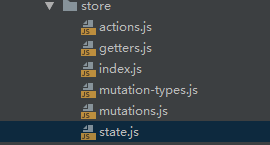
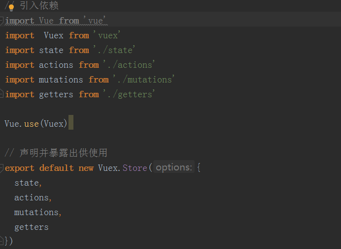
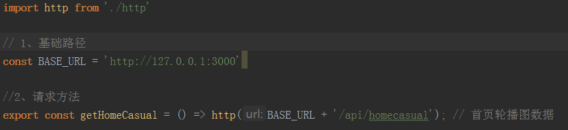
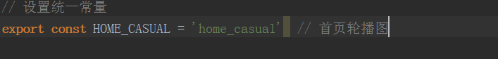
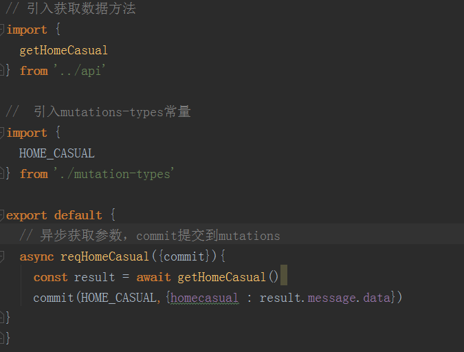
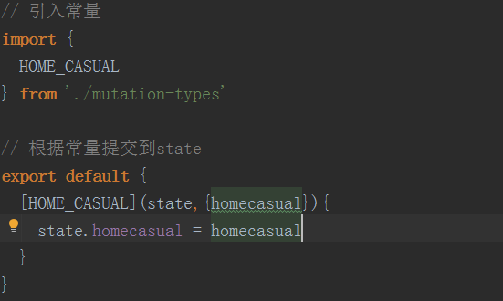

# 1、项目初始化

## 1.1、项目结构


## 1.2、视口配置

```
<meta name="viewport" content="width=device-width, initial-scale=1.0, maximum-scale=1.0, minimum-scale=1.0, user-scalable=no">
```

## 1.3、解决点击300MS问题

产生原因：为了区分用户的单击和双击行为

```
安装：
npm install fastclick -S
引入（main.js）:
import FastClick from 'fastclick'
FastClick.attach(document.body)
```

# 2、首页功能思路

## 2.1、底端路由切换图片和文字添加样式

```
1、通过&.router-link-active实现路由颜色切换
2、通过$route.path和'/路由'对比切换图片
使用includes检测包含


tabBarImgArr: [
        {
          normal: require('@/common/img/icon_home.png'), selected: require('@/common/img/icon_home_selected.png')
        }]
```

## 2.2、首页头部可滑动tab--ly-tab

```
安装：
npm i ly-tab -S
使用：
import LyTab from 'ly-tab'
Vue.use(LyTab)

1、配置2级路由，设置默认首页
2、实现点击切换功能，lytab检测的事件是change，所以绑定用change事件
3、设置个二级路由数组通过传过来的索引切换路径
```

## 2.3、首页轮播图swiper

```
安装：
npm i swiper --save
Html结构，引入js，css，创建实例传入配置项
```

```
mounted（）{
 获取数据
 this.$store.dispatch('reqHomeCasual') actions里设置的方法
}

把数据存入state库里
import { mapState } from 'vuex'
computed: {
    ...mapState(['homecasual'])  state设置的接收数组
}

1、根据homecasual.length > 0判断是否显示轮播图
2、通过watch属性监听，获取属性后再进行swiper实例化
异步执行，$nextTick
  watch:{
    homecasual(){
      this.$nextTick(() => {
        // 创建swiper实例
        new Swiper ('.swiper-container', {
          autoplay: true,
          loop: true, // 循环模式选项
          // 如果需要分页器
          pagination: {
            el: '.swiper-pagination'
          }
        })
      })
    }
  }
```


## 2.4、热门导航HotNav

```
1、隐藏水平滚动条：需要做兼容处理否则不生效  &::-webkit-scrollbar
2、根据屏幕长度，热门导航区域长度，导航条容器长度，动态确定导航条填充容器的长度
3、根据内容滚动距离，内容容器长度，滚动条容器长度，确定滚动条滚动距离
4、做边界限定
```

# 3、数据库

## 3.1MySql安装

```
https://www.jianshu.com/p/c89bace95cfa
```

## 3.2、服务器搭建

```
1、全局安装express
npm install express-generator@4 -g
2、设置视图模板
express --view=ejs demo1
3、安装依赖
npm i
4、启动服务
set DEBUG=myapp & npm start
```

## 3.3、数据库和服务器链接

```
安装依赖
npm i mysql -S
```

# 4、Vuex

## 4.1、目录结构



## 4.2、入口函数index配置



## 4.3、api中统一配置接口路径



## 4.4、mutations-type配置统一常量



## 4.5、actions到mutations



## 4.6、mutations到state

