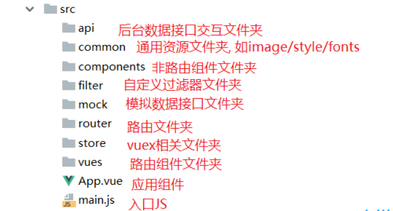

# 1、项目初始化

## 1.1、项目结构



## 1.2、视口配置

```
<meta name="viewport" content="width=device-width, initial-scale=1.0, maximum-scale=1.0, minimum-scale=1.0, user-scalable=no">
```

## 1.3、解决点击300MS问题

产生原因：为了区分用户的单击和双击行为

```
安装：
npm install fastclick -S
引入（main.js）:
import FastClick from 'fastclick'
FastClick.attach(document.body)
```

# 2、首页功能思路

1、底端路由切换图片和文字添加样式

```
1、通过&.router-link-active实现路由颜色切换
2、通过$route.path和'/路由'对比切换图片
使用includes检测包含


tabBarImgArr: [
        {
          normal: require('@/common/img/icon_home.png'), selected: require('@/common/img/icon_home_selected.png')
        }]
```

2、首页头部可滑动tab--ly-tab

```
安装：
npm i ly-tab -S
使用：
import LyTab from 'ly-tab'
Vue.use(LyTab)

1、配置2级路由，设置默认首页
2、实现点击切换功能，lytab检测的事件是change，所以绑定用change事件
3、设置个二级路由数组通过传过来的索引切换路径
```

3、首页轮播图swiper

```
安装：
npm i swiper --save
Html结构，引入js，css，创建实例传入配置项
```

4、热门导航HotNav

​	1、隐藏水平滚动条：需要做兼容处理否则不生效  &::-webkit-scrollbar
​	2、根据屏幕长度，热门导航区域长度，导航条容器长度，动态确定导航条填充容器的长度

```
data () {
    return {
      // 获取屏幕长度
      screenWidth: document.documentElement.clientWidth || document.body.clientWidth,
      // 滚动内容长度
      scrollWidth: 720,
      // 滚动条容器长度
      scrollBox: 100,
      // 滚动条内容长度
      scrollContentWidth: 0
    }
  }
```

